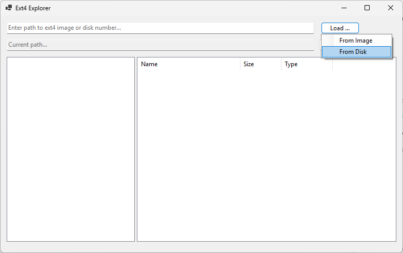
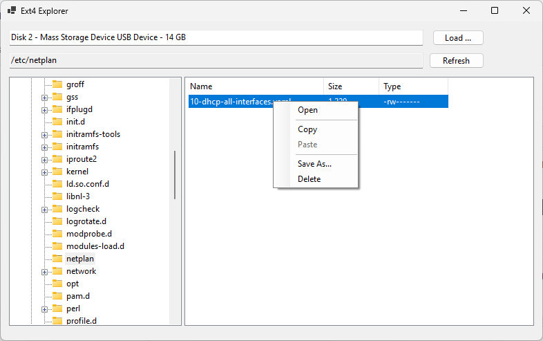

# SharpExt4Explorer

**SharpExt4Explorer** is a Windows desktop application that allows you to explore and manage Linux **Ext4 file systems** directly from your PC.  
It supports both physical drives and disk image files, with the ability to read and write to Ext4 partitions.

---

## 🔍 Features

- Explore Ext4 partitions from physical disks or image files  
- View detailed partition information and metadata  
- Compatible with both **MBR** and **GPT** partition tables  
- Clean, user-friendly **Windows Forms** interface  

---

## 📦 Downloads

Download the latest version from the [Releases page](https://github.com/nickdu088/SharpExt4Explorer/releases).

---

## 🖼️ Screenshots

  

---

## 🚀 Usage

1. Launch the application  
2. Choose whether to load partitions from a disk image or physical drive  
3. Select a partition to browse its contents  

---

## 🧪 Building from Source (Optional)

If you’d like to build the project yourself:

### Requirements

- Windows 10 or newer  
- [.NET 6.0 SDK](https://dotnet.microsoft.com/en-us/download/dotnet/6.0)  
- Visual Studio 2022 or later  
- x86 platform (configured in project settings)

### Steps

1. Clone the repository  
2. Open the solution in **Visual Studio 2022**  
3. Restore NuGet packages  
4. Build the project in **Release** mode  
5. Output will be located in the `bin\Release` directory  

---

## 📦 Dependencies

- [SharpExt4](https://github.com/nickdu088/SharpExt4) (included as DLLs)  
- `System.Management` (Windows-only)

---

## 🤝 Contributing

Contributions are welcome!  
You can report issues, suggest features, or submit pull requests.  
Please follow standard C# coding conventions and document any significant changes.

---

## 📄 License

This project is licensed under the [MIT License](LICENSE).

---

## 📬 Contact

**GitHub Repository:** [nickdu088/SharpExt4Explorer](https://github.com/nickdu088/SharpExt4Explorer)  
If you find the project useful, please consider **starring** the repo ⭐ to show your support!
